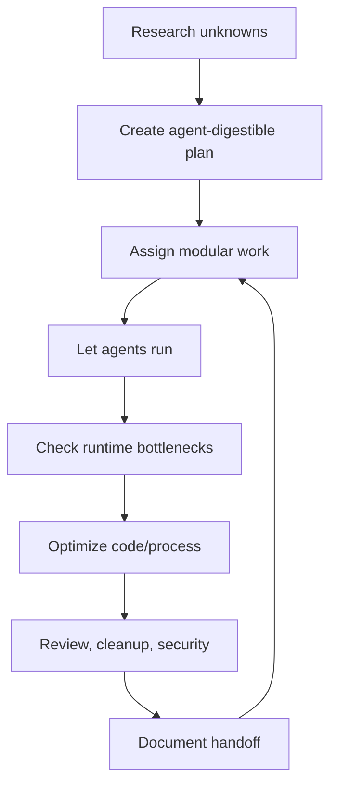

# Ramping Your Coding Output with OpenAI's Codex

**Source:** `raw/Ramping Your Coding Output with OpenAI's Codex (ingested).md`
**Author:** Unknown, associated with PostFiat community
**Entity:** [[entities/openai-codex]]

---

## Summary

This source argues that [[entities/openai-codex|OpenAI Codex]] becomes a major productivity multiplier when treated as an autonomous production agent rather than a turn-by-turn assistant. The author frames the user as a systems designer or "CEO" and the model as a "CTO": the human defines problem space, research structure, bottlenecks, quality bars, and review cadence, while agents execute long-running work.

The core point is not "AI writes code." It is that [[concepts/agentic-coding-workflows]] require a different operating style: invest in research upfront, choose problems with verifiable outputs, allocate models by strength/cost, let agents run, create handoffs, and treat cleanup/security/review as separate jobs.

---

## Cost and ROI Frame

The author treats serious AI usage as business infrastructure, not hobby spending. The argument has two ROI frames:

| ROI Frame | Claim |
|---|---|
| Token economics | Subscription usage can be worth more than the subscription price when heavily used. |
| Labor substitution | Well-managed AI agents can approximate contractor-like throughput for some coding/research tasks. |

The useful idea is not the exact dollar number, which will change. The stable idea is **capital allocation of tokens**: spend expensive model time where autonomy, reasoning, or production quality matter; use cheaper tools for bulk analysis.

---

## Nine Principles

### 1. Assume You're Ignorant

Start by filling knowledge gaps before implementation. The source recommends running multiple research agents and then consolidating their outputs into an "AI-agent-digestible" plan.

This connects to [[concepts/epistemic-humility]] and [[concepts/first-principles-thinking]]: before coding, identify unknowns, constraints, caveats, and existing best practices.

### 2. Define Bottlenecks From Runtime Events

Do not optimize based only on initial theory. Let the agent run, observe what actually takes time or fails, then ask the agent to optimize the bottleneck it just experienced.

This is a practical feedback loop:

1. Build structure.
2. Let it run.
3. Observe runtime failures.
4. Optimize the structure.
5. Repeat.

### 3. Select The Correct Problem Space

The author says agentic coding works best where outputs are testable:

- tool use is available
- answers can be checked
- benchmarks are repeatable
- backend/infrastructure work dominates
- inputs are not too subjective or unpredictable

Creative or user-facing work with fuzzy objectives is framed as less suitable for full autonomy, at least in the author's current experience.

### 4. Choose The Right Model

The source frames model choice as capital allocation:

- expensive frontier models for long-running execution and hard autonomy
- design/documentation/checking models for review and planning
- cheaper models for bulk analysis

The stable principle: **match model cost and capability to task shape.**

### 5. Use The CEO/CTO Prompt Hack

The author suggests viewing the human as CEO and the model as CTO. The human should:

- check in periodically
- remove blockers
- provide resources
- redirect when the agent spirals
- force external research when assumptions get stale

The danger is micromanaging. The productivity gain comes from managing several autonomous streams, not staring at one screen.

### 6. Use Modular Teams and Handoffs

Agents should not all collide in one workspace. The author prefers modular repos or isolated work areas where agents build focused components, then sync after milestones.

Important rule: long-running agents need handoff processes so work can continue after context or session boundaries.

### 7. Do Not Reinvent Wheels

Use existing references, designs, libraries, and open-source patterns. With screenshot-capable models, the author recommends having agents reference real designs instead of inventing UI from scratch.

This mirrors ordinary engineering judgment: copy proven components where originality does not matter.

### 8. Treat Cleanup As A Separate Job

AI coding can leave behind technical debt, missing documentation, security risks, and messy iterative code. Cleanup should be scheduled as its own workflow:

- code review
- deletion/refactor
- documentation
- security review
- dependency and architecture cleanup

The source recommends doing this periodically rather than letting mess compound.

### 9. Create Systems To Stay Sane

The author emphasizes the psychological load of agentic work: huge context volume, decision fatigue, and not fully understanding every active thread.

Suggested support systems:

- technological reconnaissance system
- personal context management system
- habits for brain performance

This connects directly to the Second Brain project itself: the wiki acts as external memory for long-running AI-assisted work.

---

## Practical Operating Model

---

## What This Adds To The Wiki

This source complements [[sources/something-is-different-about-2026]] by making the AI-upskilling claim operational. Dan Koe's essay says skills abstract upward; this source shows what that looks like in software: the human shifts from direct coder to allocator, reviewer, planner, and systems designer.

It also connects to the wiki's own method. The LLM wiki is a form of [[concepts/agentic-coding-workflows|agentic workflow]] applied to knowledge management: raw sources enter, the agent maintains structure, and the human guides direction and taste.

## Sources

- `raw/Ramping Your Coding Output with OpenAI's Codex (ingested).md`
