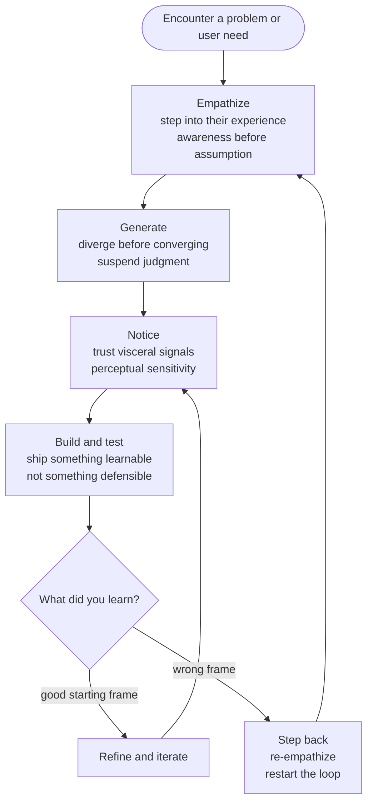

# Apple Developer Academy Prep: Design and Creativity

The tempting interpretation of this section is that it is about aesthetics and artistic talent — the part where visually gifted people shine and everyone else hopes it is not weighted heavily. That interpretation is wrong.

**The Design & Creativity section is selecting for one thing: whether you can hold a problem open long enough to actually understand it before you propose a solution.**

That means staying inside someone else's experience before assuming you know what they need. Generating many possibilities before committing to the first one that feels right. Noticing what the world is telling you before you explain it. Revising your idea based on what you learned rather than defending it.

None of those require visual talent. All of them require a particular mental discipline — one that most people have never deliberately practiced.

## What The Academy Is Really Testing

The four subsections of this material converge on the same underlying questions:

1. Can you step into another person's experience — not just describe it from outside, but actually feel with them?
2. When you face a problem, can you generate multiple divergent directions before committing to any of them?
3. Do you notice when something feels off before you can explain why — and do you trust that signal?
4. Can you treat your current version as a starting point and revise it based on what you learned, rather than defending what you built?

These are not four separate competencies. They are four expressions of the same underlying capacity: **the willingness to stay open when the situation is pulling you toward closure.**

## The Common Enemy

Every source in this section describes a different failure mode, but they all point at the same root cause: **premature closure** — settling on the first available frame, solution, empathic interpretation, or version before it has been genuinely tested.

- [[entities/ken-robinson|Robinson]] describes it in education: schools punish wrong answers so thoroughly that students stop generating uncertain ideas at all. The cost is not just creativity — it is the entire habit of exploration.
- [[entities/david-kelley|Kelley]] describes it in individuals: early creative failure, especially when humiliating, teaches people that the risk of judgment outweighs the reward of expression. They close down.
- [[entities/brene-brown|Brown]] describes it in empathy: the moment you offer a silver lining ("at least...") is the moment you close the gap and retreat from shared feeling. Sympathy is premature closure in the emotional register.
- [[entities/laura-klein|Klein]] describes it in organizations: teams that ship to the Done column and never return are closing the loop before the learning arrives.
- [[entities/alan-dix|Dix]] describes it structurally: iterating on a fundamentally flawed starting point is a kind of closure — you optimize within the wrong frame because stopping to question the frame feels like losing progress.

The unifying diagnosis: the impulse to close down is universal and often rational in the short term. The discipline of design and creativity is learning to override it long enough to do something more useful.

## Four Expressions of Openness

### Empathy: opening to other minds

[[concepts/empathy|Empathy]] requires something actively uncomfortable: you must locate in yourself some version of what the other person is carrying. Brown's formulation is precise — empathy is not observation from a distance, it is climbing down into the hole with someone. That requires vulnerability, and vulnerability requires suspending the self-protective urge to stay at the top with a sandwich.

[[entities/jonathan-juravich|Juravich]] adds the operational layer: this capacity starts with awareness of your own emotional state. You cannot recognize another person's frustration if you are not practiced at noticing your own. His daily prompts — name a moment of pride, frustration, excitement from your day — are not sentimental exercises. They are rehearsals for the empathic act of noticing without judging.

[[entities/dale-carnegie|Carnegie]] completes the loop at the behavioral level. Brown defines what empathy *is*; Juravich builds the inner awareness to *feel* it; Carnegie's principles — [[concepts/see-their-point-of-view|try honestly to see things from the other person's point of view]], [[concepts/active-listening|listen and encourage others to talk about themselves]], [[concepts/talk-in-terms-of-interests|talk in terms of the other person's interests]] — are the social-behavioral techniques for *acting on it* in real interaction. The three layers are not redundant: you can understand empathy theoretically, cultivate self-awareness daily, and still fail at the moment of actual conversation if you lack the behavioral habits Carnegie describes.

For product design specifically, the empathize stage of [[concepts/design-thinking|design thinking]] only produces useful insight when it reaches this depth. Shallow empathy produces personas that describe users without understanding them — and never changes what gets built.

### Creative generation: opening to many possibilities

[[concepts/creative-confidence|Creative confidence]] is the precondition for [[concepts/divergent-thinking|divergent thinking]] to function at all. If you believe your ideas will be judged as evidence of your worth, you stop generating them before they are formed. Kelley's insight — confirmed by Bandura's guided mastery research — is that this is not a personality trait but a recoverable capacity. Small creative successes, scaffolded carefully, rebuild the willingness to be uncertain in public.

[[entities/john-kounios|Kounios]] adds the neuroscience: creative insight requires low frontal-lobe activity. High anxiety — exactly the state produced by fear of judgment — increases frontal activity and narrows thinking to analytical depth-first processing. Robinson's education critique and Kounios' brain imaging data are describing the same phenomenon from different scales: the same institutional and psychological conditions that suppress creativity also produce the exact neurological state in which insight cannot occur.

### Perceptual sensitivity: opening to what the world is already saying

[[entities/don-norman|Norman]]'s three levels of emotional design (visceral, behavioral, reflective) are a map for noticing what is already happening before you explain it. The visceral response — something feels wrong, this feels right — arrives before conscious evaluation. Training an eye for design means learning to notice and trust that signal rather than suppressing it until you can justify it analytically.

Norman's finding that positive affect enables breadth-first thinking is the cognitive version of this: when you are relaxed and not under threat, your associative range opens. You perceive more connections between things that are not obviously related. That is both what makes you a better designer and what makes you a better creative thinker. The two capacities share the same underlying brain state.

The skill Juravich is teaching children — name what you notice, every day — is also what a designer needs to develop. Noticing before explaining. Reporting the emotional signal before the analytical frame closes around it.

### Iteration: opening to being wrong

[[concepts/iterative-development|Iterative development]] is the discipline of treating your current version as a hypothesis, not an answer. Klein's Done Column anti-pattern names the failure mode: shipping and never returning is an organizational version of the same closure that Robinson describes in individuals. Both systems have learned to treat completion as the goal rather than learning.

Dix's [[concepts/local-maxima|local maxima]] insight adds the sharpest warning: a bad starting point, iterated carefully, produces a polished version of the wrong thing. You can do everything right — ship early, test honestly, respond to feedback — and still end up in the wrong place if your initial frame of the problem was wrong. This is why iteration alone is not enough. It requires the empathy and perceptual sensitivity that come earlier in the cycle to give it a good starting frame.

## How They Reinforce Each Other

These four capacities are not independent. They form a loop:

The loop requires each capacity to hand off to the next:
- Without empathy, the starting frame is your projection, not the user's reality — Dix's local maxima problem appears immediately
- Without divergent generation, you implement the first frame rather than testing it against alternatives
- Without perceptual sensitivity, you cannot tell when a prototype is producing the right emotional response in users
- Without iteration, the learning from all three has nowhere to go

A designer who is strong in three of these and weak in one will get stuck at the same point every time.

## The Cognitive Layer

The four capacities share one neurological substrate. [[concepts/focused-vs-diffuse-thinking|Diffuse thinking]] — the loose, associative brain state Oakley describes — is the state in which empathy, insight, perceptual sensitivity, and creative generation are all most available. [[concepts/insight-vs-analytical-thinking|Kounios' insightful mode]] is the same state described at the neural level: low frontal activity, remote associations crossing into awareness.

Norman's design insight closes the loop: **objects and environments that produce positive affect push the brain toward this state.** Good design is not just the output of this capacity — it is a tool for creating the conditions in which the capacity operates. A well-designed workspace, tool, or interface is literally more creatively enabling for the people who use it.

This is not a soft point. Anxiety, fear of judgment, and threat — all the forces that Robinson and Kelley name as creativity's enemies — neurologically narrow the thinking that empathy, generation, perceptual sensitivity, and iteration all require. Removing fear is not a warmth intervention. It is a cognitive performance intervention.

## What To Practice Before The Academy

**Empathy drill.**
Once a day, before describing a problem involving another person, ask: what might they be feeling right now, and what would it mean to feel that with them rather than about them? Juravich's prompts work: name a moment of pride, frustration, excitement — yours first, theirs second.

**Generation drill.**
When facing a design or product question, force three divergent directions before evaluating any of them. The first idea is rarely wrong, but it is rarely the best. Name the alternatives before closing.

**Perceptual drill.**
Once a day, notice something in your environment that feels off or unusually right — a piece of software, a physical object, a space — and articulate why at each of Norman's three levels: immediate appearance, feel in use, meaning it carries.

**Iteration drill.**
For any project you are working on, identify what you would learn from putting it in front of a real user tomorrow — not when it is perfect, but now. What would change in your next version based on what they did or felt?

## What The FGD Is Actually Testing

The sources above describe what the Academy wants to develop. A Kohort 7 alumni from ADA Indonesia has confirmed what the selection process is actually testing in the [[entities/Apple-Developer-Academy-Indonesia|Focus Group Discussion]] — and the alignment is almost exact.

The FGD splits applicants into two groups, has each build a solution to the essay topic, then has the groups exchange criticism. The three formal criteria are creativity, collaboration, and communication. But beneath those labels, the evaluators are watching for the same four capacities.

**Empathy in the FGD** means "empathy over ego" — not treating the session as a debate to win, but treating criticism from the other group as information from a different vantage point. Group tension is built into the format deliberately; the question is whether you harden against it or stay open to it. Listen actively. Show that you're receiving ideas, not just tolerating them. If someone critiques your proposal, ask *why* they think their approach is stronger — genuinely. Don't shut down and don't go defensive.

**Divergent thinking in the FGD** is not about generating many ideas openly but about not being captured by your own first idea. The group that anchors too hard on its first solution and defends it against all challenges has stopped generating. The stronger move is to treat criticism as new input and let your solution evolve.

**Thinking out loud** is the perceptual sensitivity applied to your own reasoning — making your framework visible to the group rather than only surfacing conclusions. The alumni's formulation: *"The goal isn't to find the best answer. The goal is to find the best way to an answer."* Your idea may not be chosen. But if the team could see how you approached the problem — what you noticed, what angles you considered, how you handled not knowing — that is what gets remembered. Don't be someone who produces outputs silently and reveals them only when complete.

**Don't kill the vibe** is iteration at the social level. The same way iterative development asks you to treat your current design as a hypothesis rather than an achievement, the FGD asks you to treat the group's current dynamic as something to maintain and improve — not something to win over. Be someone who can raise the energy when the discussion stalls. Be the person who makes thinking easier for everyone in the room, not harder.

## Portfolio as Design Practice

The portfolio section of the online application is a direct test of the same capacities. The most common mistake is treating it as an app gallery. The alumni's reframe is crisp: **don't start from what technology you used; start from what problem your product solves and how.**

A Figma mockup that walks through the full problem-solving process — empathy research, problem definition, ideation, prototype rationale — is stronger than a shipped app that jumps from "I had an idea" to "here is the code." A YouTube channel that shows a sustained passion for teaching is stronger than a to-do list app that shows only that you followed a tutorial.

The portfolio is the Academy's first window into how you think, not what you've built. Show the process, not just the artifact.

## The Deeper Point

The Design & Creativity section is not a softer version of the other sections. It is asking whether you can apply the same learning discipline from the Learning & Thinking section — stay open, diagnose before solving, revise based on evidence — to a domain where the feedback is emotional and embodied rather than logical and propositional.

Users do not tell you what is wrong in well-formed arguments. They feel something, hesitate somewhere, abandon the flow at a point that reveals something important. The designer's job is to notice what the user could not articulate. That requires all four of the capacities this section is training — and the willingness to stay uncertain long enough for the signal to become visible.

What the FGD makes clear is that the Academy is not only selecting for people who think this way about users. It is selecting for people who bring the same posture to their own teams and collaborative processes. Epistemic patience in design. Epistemic patience in collaboration. The same capacity, applied outward to users and inward to teammates.

## Connections

- [[synthesis/apple-developer-academy-prep-learning-and-thinking]] — the learning and thinking substrate that underlies this section; creative confidence and growth mindset are the same discipline applied to different material
- [[synthesis/apple-developer-academy-prep-computational-thinking]] — CT is the analytical problem-solving layer; design thinking is the human-centered diagnosis layer; both are needed
- [[synthesis/diagnosis-before-solution]] — the empathize → define sequence is diagnosis applied to human experience
- [[concepts/creative-confidence]]
- [[concepts/divergent-thinking]]
- [[concepts/empathy]]
- [[concepts/see-their-point-of-view]]
- [[concepts/active-listening]]
- [[concepts/talk-in-terms-of-interests]]
- [[concepts/design-thinking]]
- [[concepts/emotional-design]]
- [[concepts/iterative-development]]
- [[concepts/local-maxima]]
- [[concepts/focused-vs-diffuse-thinking]]
- [[concepts/insight-vs-analytical-thinking]]
- [[concepts/self-efficacy]]
- [[concepts/thinking-out-loud]] — making reasoning visible in the FGD
- [[concepts/t-shaped-developer]] — the profile the Academy is selecting for; this section trains the breadth axis
- [[entities/Apple-Developer-Academy-Indonesia]]

## Sources

- [[sources/how-to-build-your-creative-confidence]]
- [[sources/the-science-behind-creativity]]
- [[sources/do-schools-kill-creativity]]
- [[sources/creativity-insight-and-eureka-moments]]
- [[sources/how-to-win-friends-and-influence-people]]
- [[sources/brene-brown-on-empathy]]
- [[sources/how-do-you-teach-empathy-jonathan-juravich]]
- [[sources/three-ways-good-design-makes-you-happy-don-norman]]
- [[sources/develop-an-eye-for-good-visual-design]]
- [[sources/what-is-iterative-development]]
- [[sources/cara-gue-masuk-apple-developer-academy]]
