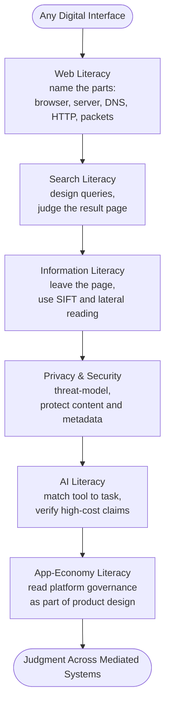

# Apple Developer Academy Prep: Digital Literacy

Digital literacy is often treated like basic computer fluency: use a browser, search online, install apps, avoid obvious scams. The sources in this cluster point to a stronger standard.

**Digital literacy is the ability to keep your judgment while moving through systems that rank, personalize, generate, filter, monetize, and mediate reality for you.**

That is why this belongs in Apple Developer Academy prep. You are not only learning to code or design. You are entering a world built on web infrastructure, search ranking, misinformation loops, privacy tradeoffs, AI systems, and app-store economics. A passive user moves through that world as if the interface is neutral. A capable builder sees the layers underneath: what is being requested, ranked, verified, exposed, generated, governed, and sold.

## The Six-Layer Stack

### 1. Web literacy: know what is happening beneath the screen

The first layer is basic web literacy: understanding that the page on your screen is the visible end of a request chain. [[sources/how-the-web-works-mdn]] explains the chain simply. A [[concepts/web-browser|web browser]], the app you use to access the web, sends a request. [[concepts/dns|DNS]], the naming system that translates a domain like `apple.com` into an address computers can route to, helps the browser find the right server. A [[concepts/web-server|web server]], the machine or service hosting the resource, sends something back. [[concepts/http|HTTP]], the request-response protocol of the web, carries the exchange. [[concepts/packets|Packets]], small chunks of data, move the response across the network and get reassembled into the page or asset you see.

[[sources/browsing-the-web-mdn]] adds the vocabulary that keeps beginners from collapsing everything into one blur. A web page is one document. A website is a collection of related pages. A web service is a server-side function that performs work or returns data, such as login, weather, search, or payment processing. A search engine is not the browser; it is a web service you reach through the browser to discover other pages.

That vocabulary is not pedantry. It is the grammar of the digital environment. If you cannot distinguish browser, page, website, server, service, URL, DNS, and HTTP, then every failure feels like "the internet is broken." Once those parts become visible, problems become diagnosable. You can ask whether the address is wrong, the server is down, the page failed to load assets, the search engine ranked poor results, or the browser is only showing you the interface layer of a deeper service.

[[sources/the-world-wide-web-crash-course-computer-science-30]] adds the historical reason this matters. The web became powerful because URLs, HTML, browsers, and hyperlinks turned the internet from connected machines into a navigable public information system. That history is useful for Academy prep because apps still sit inside that older web logic: addresses, protocols, links, documents, requests, and services.

### 2. Search literacy: retrieval is not truth

Search literacy begins with one uncomfortable fact: a search result is not an answer. [[sources/google-and-other-search-engines]] explains that search engines crawl pages, build indexes, and rank results using relevance signals, personalization, freshness, popularity, advertising, and other hidden rules. [[concepts/search-engine|Search engines]] are retrieval systems, meaning they surface candidate sources for you to inspect. They do not certify that the top result is true.

This is where [[concepts/search-operators|search operators]], small syntax tools that constrain a query, become practical. Quotation marks force an exact phrase. `site:` limits results to one domain. `filetype:pdf` looks for a specific document type. A minus sign excludes a term that keeps polluting the results. `OR` broadens the query when a topic has multiple names. `intitle:` asks for a word in the page title, which usually means the page is centrally about that term rather than merely mentioning it.

Those tools matter because searching is not only typing words. It is query design. You are telling the system what kind of evidence you want, where it should come from, and what noise to avoid. A weak searcher accepts the first result page as reality. A stronger searcher changes the search environment, changes the query, and changes the evidence standard.

[[sources/effective-internet-searching]] makes the same point through academic research. Ordinary Google is useful for public web discovery, but much serious academic material lives in the deep web, meaning paywalled databases, library systems, and institutional repositories that general search crawlers cannot fully index. [[concepts/google-scholar|Google Scholar]], a search tool focused on academic papers, books, theses, and grey literature, is a good bridge into scholarly material, but it is not a quality filter. It can surface reputable papers beside less rigorous work, and citation counts show influence rather than truth. For serious research, library databases still matter because they offer better metadata, filtering, and institutional access.

The Academy lesson is direct: when you research a product, technology, user problem, or design precedent, you are not just gathering links. You are choosing what kind of evidence your thinking will be built from.

### 3. Information literacy: leave the page before the page persuades you

Information literacy is the ability to judge claims, sources, and evidence before you believe or share them. The verification sources make one strong claim: credibility is often easier to evaluate from outside the page than from inside it.

[[concepts/lateral-reading|Lateral reading]] means leaving the page to investigate it through other tabs. Instead of reading a source's About page, admiring its design, and trusting its own description, you search what other sources say about it. [[sources/check-yourself-with-lateral-reading]] shows why this works. Professional fact-checkers quickly left the page, checked external sources, and identified reliable sources correctly. Students read vertically, staying inside the page, and were fooled by polished design.

[[concepts/sift-method|SIFT]] is the portable routine for this habit: Stop, Investigate the source, Find better coverage, and Trace claims to their original context. "Stop" interrupts the emotional reflex to believe or share. "Investigate" asks who is behind the claim. "Find better coverage" asks whether other credible sources report the same thing. "Trace" follows quotes, images, statistics, or claims back toward the original source so you can see what was actually said or shown.

[[sources/how-false-news-can-spread-noah-tavlin]] explains the structural danger. [[concepts/circular-reporting|Circular reporting]] happens when a weak or false claim is repeated across outlets until repetition looks like confirmation. The claim has not gained evidence; it has gained echoes. [[sources/beware-online-filter-bubbles]] widens the problem with [[concepts/filter-bubble|filter bubbles]], personalized information environments where ranking systems hide what they filtered out. You may not know which perspectives never reached you.

This is why information literacy belongs in Academy prep. Product work depends on claims: user claims, market claims, technical claims, design claims, AI-generated claims. If you cannot evaluate claims, you can still build, but you will build on sand.

### 4. Privacy and security: freedom needs protected space

Privacy is often misunderstood as secrecy for people doing something wrong. [[sources/glenn-greenwald-why-privacy-matters]] argues for a better frame: privacy is the protected space where people think, explore, dissent, experiment, and become themselves without constant observation. Surveillance changes behavior because watched people self-edit. The harm is not only that someone might punish you. The harm is that you start narrowing yourself in advance.

[[sources/surveillance-self-defense-security-basics]] turns that civic argument into practice. [[concepts/threat-modeling|Threat modeling]] means deciding what you need to protect, who you need to protect it from, how likely the threat is, and what protection costs. It prevents security from becoming either panic or vibes. You do not need every possible defense. You need defenses that match your real situation.

The source also distinguishes content from [[concepts/communication-metadata|communication metadata]], the information around a message rather than inside it: who contacted whom, when, where, from what device, and how often. Even if message content is encrypted, metadata can reveal relationships, routines, location patterns, and social structure.

For Academy life, this matters in ordinary ways. You will use cloud tools, repositories, chats, accounts, devices, and collaboration platforms. You will also build products that collect, store, or infer things about users. A beginner asks, "Is the feature useful?" A stronger builder also asks, "What does this expose, who controls it, and what assumptions are we making about trust?"

### 5. AI literacy: generated fluency is not grounded knowledge

AI literacy starts with demystifying learning. [[sources/how-does-artificial-intelligence-learn]] introduces three learning modes. [[concepts/supervised-learning|Supervised learning]] learns from labeled examples, like images already marked as healthy or diseased. [[concepts/unsupervised-learning|Unsupervised learning]] looks for patterns without pre-labeled answers, like clustering similar patient profiles. [[concepts/reinforcement-learning|Reinforcement learning]] improves through feedback over time, like adjusting a treatment strategy based on outcomes. [[concepts/artificial-neural-networks|Artificial neural networks]] are layered computational systems inspired loosely by brain connections; they learn patterns through many weighted connections, which makes them powerful but often hard to interpret.

That foundation matters because it stops AI from looking like magic. AI systems are trained pattern learners. They can be useful, surprising, and fast, but they do not become truth engines just because their output sounds fluent.

[[sources/search-engines-vs-ai-assistants]] makes the most important practical distinction. Search engines retrieve sources. [[concepts/ai-assistants|AI assistants]] generate answers. The boundary is blurring because search engines now include AI summaries and AI assistants can browse the web, but the underlying trust problem remains different. Retrieval gives you documents to inspect. Generation gives you composed language that may blend accurate material, weak inference, missing context, and unsupported claims.

[[sources/when-ai-gets-it-wrong]] names the two failure modes Academy students need to recognize. [[concepts/ai-hallucinations|AI hallucinations]] are fluent fabrications: invented facts, cases, citations, or explanations presented with confidence. *Mata v. Avianca* is the clean example: a lawyer submitted legal authorities generated by ChatGPT, but the cases did not exist. [[concepts/ai-bias|AI bias]] is the reproduction or amplification of unfair patterns from data and institutions, such as image models reinforcing racial or gender stereotypes or language models producing different-quality outputs based on demographic cues.

The practical response is not to avoid AI. It is to use AI according to task. Use AI assistants for explanation, brainstorming, drafting, comparison, and transformation. Use search, library databases, official documentation, primary sources, and lateral reading when provenance matters. Ask AI to help you think, but verify when the output will shape decisions, claims, code, research, or user-facing work.

Two techniques help but do not remove responsibility. Chain-of-thought prompting, asking the model to reason step by step, can expose gaps or force a more inspectable path. Temperature control changes how random or varied the output is: low values like 0 to 0.3 are better for consistency, while higher values like 0.7 to 1.0 suit brainstorming. These are steering tools, not guarantees.

### 6. App-economy literacy: software reaches users through governed marketplaces

The app-store sources move digital literacy from user behavior to ecosystem structure. [[concepts/app-economy|The app economy]] is not just people buying apps. It is the economic system around app creation, distribution, monetization, and the much larger commerce layer that apps mediate. [[sources/the-trillion-dollar-app-economy]] makes this visible: in 2022, the App Store ecosystem facilitated about $1.123 trillion in billings and sales, and most of that was not app purchases. Physical goods and services made up 81 percent of the total. General retail alone was $621 billion.

That means apps are not merely software objects. They are interfaces into commerce, logistics, media, education, transport, food, health, finance, communication, and daily life. When you build an app, you are often building a doorway into a larger economic system.

[[sources/the-app-store-turns-10]] shows Apple's preferred story: the App Store lowered distribution friction, helped small developers reach global users, created trust through curation, and spread apps across everyday life. [[sources/a-brief-history-of-the-app-stores]] adds the governance story. [[concepts/platform-governance|Platform governance]] means the rules, rankings, review systems, economic terms, privacy policies, and interface controls through which a platform decides what can be published, discovered, trusted, monetized, or removed.

The Apple-versus-Google timeline matters because platform rules did not appear fully formed. They accumulated through many decisions: review guidelines, app rankings, search ads, subscription terms, privacy labels, anti-fraud systems, App Tracking Transparency, developer replies, app trials, and commission changes. A commission policy is not just a business detail. It changes which products can survive. A ranking rule is not just a sorting detail. It changes what users ever see. A review rule is not just quality control. It decides what kinds of software are allowed to exist at scale.

For Academy prep, this is the point: you are learning to build inside governed marketplaces. Good product thinking has to include distribution, trust, incentives, platform rules, and user rights, not only interface polish or feature ideas.

## The Six-Layer Stack

Every layer is a place where a passive user stops and a literate one keeps going. The arrow is not strictly sequential — in practice you move between layers depending on what you are doing — but the direction of increasing agency holds.

---

## One Operating Model

The six layers are one mental model for digital agency.

| Layer | What To Understand | What To Practice |
|---|---|---|
| Web | Screens are the visible end of requests, servers, protocols, and services | Name the parts before diagnosing the problem |
| Search | Results are ranked candidates, not certified truth | Design queries and judge the result page |
| Information | Credibility is checked by leaving the page, not admiring it | Use SIFT, lateral reading, and source tracing |
| Privacy | Digital life exposes content, metadata, habits, and relationships | Threat-model before choosing defenses |
| AI | Generated fluency can hide missing evidence, bias, or fabrication | Match tool to task and verify high-cost claims |
| App economy | Apps reach users through marketplaces with rules and incentives | Treat platform governance as part of product design |

The throughline is simple: every digital interface hides a system. Search hides ranking. Social feeds hide filtering. AI hides training data and generation. Messaging hides metadata. App stores hide governance. A strong Academy learner does not become paranoid about those systems, but does become literate in them.

The practical questions are:

1. What system am I inside right now?
2. What is being ranked, filtered, generated, or hidden?
3. What evidence would make this trustworthy?
4. What data or metadata am I exposing?
5. Is this task better served by retrieval, generation, or direct verification?
6. What platform rules shape whether this product reaches users?

## Why This Matters For The Academy

The Academy is not only a coding environment. It is a judgment environment. You will search for technical answers, evaluate sources, use AI, collaborate through cloud tools, protect accounts and devices, study user problems, and build for app ecosystems shaped by Apple, Google, and other platforms.

Weak digital literacy can look productive for a while. You can copy fast, trust the top result, accept an AI answer because it sounds clean, ignore metadata, or design an app without thinking about distribution rules. The problem is not that you will fail immediately. The problem is that your work becomes dependent on systems you do not understand.

Strong digital literacy gives you more agency. You understand enough of the web to demystify it, enough of search to use it deliberately, enough of verification to distrust appearances, enough of privacy to protect room for thought, enough of AI to use it without surrendering judgment, and enough of the app economy to see product work as participation in a governed marketplace.

That is the synthesis:

**Digital literacy is not tool fluency. It is judgment across mediated systems.**

## Connections

- [[synthesis/apple-developer-academy-prep-learning-and-thinking]]
- [[synthesis/apple-developer-academy-prep-computational-thinking]] — CT is the method for building solutions once the problem is framed; digital literacy is the judgment layer for navigating the environment those solutions live in
- [[concepts/world-wide-web]]
- [[concepts/search-engine]]
- [[concepts/lateral-reading]]
- [[concepts/privacy]]
- [[concepts/ai-assistants]]
- [[concepts/app-economy]]
- [[concepts/platform-governance]]

## Sources

- [[sources/browsing-the-web-mdn]]
- [[sources/how-the-web-works-mdn]]
- [[sources/the-world-wide-web-crash-course-computer-science-30]]
- [[sources/google-and-other-search-engines]]
- [[sources/effective-internet-searching]]
- [[sources/check-yourself-with-lateral-reading]]
- [[sources/beware-online-filter-bubbles]]
- [[sources/the-sift-method]]
- [[sources/how-false-news-can-spread-noah-tavlin]]
- [[sources/glenn-greenwald-why-privacy-matters]]
- [[sources/surveillance-self-defense-security-basics]]
- [[sources/how-does-artificial-intelligence-learn]]
- [[sources/search-engines-vs-ai-assistants]]
- [[sources/when-ai-gets-it-wrong]]
- [[sources/a-brief-history-of-the-app-stores]]
- [[sources/the-app-store-turns-10]]
- [[sources/the-trillion-dollar-app-economy]]
