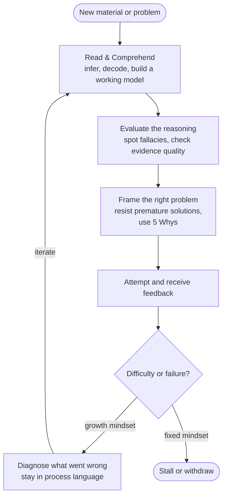

# Apple Developer Academy Prep: Learning and Thinking

Most people preparing for Apple Developer Academy are tempted to focus on visible output: coding syntax, app ideas, design polish, maybe a few interview answers. That matters, but this material points to a deeper thesis:

**The Academy is not mainly selecting for what you already know. It is selecting for how fast, how honestly, and how flexibly you can learn once the environment gets hard.**

That makes the whole "Learning & Thinking" section less like a soft warm-up and more like the hidden substrate of everything else. [[concepts/critical-thinking|Critical thinking]], [[concepts/problem-framing|problem framing]], [[concepts/inductive-reasoning|inductive and deductive reasoning]], [[concepts/growth-mindset|growth mindset]], and [[concepts/inferencing|reading comprehension]] are not five separate school topics. They are five parts of one operating system for surviving a fast-moving learning environment where the tools, terminology, and expectations keep changing.

## What The Academy Is Really Testing

The common pattern across these materials is not "be smart." It is closer to this:

1. Can you tell the difference between a claim and a good argument?
2. Can you resist the urge to solve the first version of the problem?
3. Can you reason under uncertainty without pretending correlation is causation?
4. Can you stay functional when difficulty hits your identity?
5. Can you read dense English material closely enough to keep learning on your own?

That combination matters because Apple Developer Academy is a compressed environment. You are asked to learn new tools, absorb documentation, work in teams, explain decisions, accept critique, and keep going when your first idea fails. Someone with less prior exposure but better learning machinery can outperform someone who arrives with more surface knowledge and worse adaptation.

## The Five-Layer Stack

### 1. Critical thinking keeps you from being led by noise

[[concepts/critical-thinking|Critical thinking]] is the outer discipline: define the question, inspect the evidence, test the reasoning, consider alternatives. The fallacy material makes that more concrete. It trains the eye to notice recurring failure modes such as [[concepts/false-cause-fallacy|false cause]], [[concepts/false-analogy|false analogy]], [[concepts/argument-from-ignorance|argument from ignorance]], [[concepts/slippery-slope-fallacy|slippery slope]], [[concepts/middle-ground-fallacy|middle-ground]], and [[concepts/circular-reasoning|circular reasoning]].

Why does that matter for Academy prep? Because project work is full of persuasive nonsense in mild forms: "users liked it, so it must be good," "this feature worked once, so let's scale it," "we have no evidence against this assumption, so it is probably fine." Strong learners do not just produce opinions faster. They ask what would actually count as a good reason.

### 2. Problem-solving starts before solutions

The problem-solving section points hard at one principle: [[synthesis/diagnosis-before-solution|diagnosis before solution]]. [[concepts/5-whys|5 Whys]] drills beneath symptoms. [[concepts/problem-framing|Problem framing]] slows down the rush to solve the wrong thing. [[concepts/computational-thinking|Computational thinking]] provides the downstream counterpart: once the right problem is identified, CT gives a systematic method for building the solution — decompose, recognize patterns, abstract away noise, then construct the algorithm. Together they form a complete problem-handling stack that matters in product work, teamwork, and self-correction.

This is especially relevant in beginner builder environments, because novices often mistake speed for competence. They jump from "we need an app for X" to "let's build feature Y" without checking whether X was even the real problem. The better move is slower and stronger: what is actually failing, for whom, under what constraints, and what evidence says this is the right frame?

The Academy is likely to reward people who can stay upstream longer than their impulse wants to.

### 3. Logic and reasoning keep your confidence calibrated

The logic subsection is really about epistemic hygiene. [[concepts/inductive-reasoning|Inductive reasoning]] lets you move from examples to probable patterns. [[concepts/deductive-reasoning|Deductive reasoning]] lets you move from rules to necessary conclusions. Both are useful, but they answer different kinds of questions. Confusing them produces fake certainty.

The correlation-causation material sharpens this further. [[concepts/correlation-vs-causality|Correlation vs causality]] is one of the most practical distinctions in modern thinking because people constantly mistake a pattern for an explanation. In learning, that can mean copying the habits of successful people without understanding the mechanism. In product work, it can mean assuming a usage spike proves value. In teamwork, it can mean building a story around one visible event while missing the real cause.

This is why the section belongs next to critical thinking rather than apart from it. It teaches not only how to think, but how not to overclaim from weak evidence.

### 4. Mindset determines what happens at the moment of friction

This cluster is the emotional engine of the whole stack. [[concepts/growth-mindset|Growth mindset]], [[concepts/fixed-mindset|fixed mindset]], [[concepts/learning-from-failure|learning from failure]], and [[concepts/grit|grit]] all ask the same question from different angles:

**What do you do when the work stops flattering you?**

That is the real test. Anyone can feel capable when the task is easy and the feedback is positive. What separates durable learners is their interpretation of difficulty. If effort means "I am not talented," challenge becomes identity threat. If effort means "I am in the part where ability grows," challenge becomes usable.

This does not mean romanticizing struggle. The failure material makes an important correction: failure does not automatically teach. Some failure is too demoralizing, too ambiguous, or too identity-threatening to become useful by itself. That means Academy prep should not aim at generic toughness. It should aim at staying open to correction while still being able to diagnose what actually went wrong.

Duckworth's grit adds time horizon. Dweck explains how to stay in the learning loop after setback. Duckworth explains why staying in that loop long enough matters.

### 5. Reading comprehension is the hidden force multiplier

The Academy will not only ask you to think. It will ask you to think through English materials: articles, slides, documentation, feedback, and discussion. That makes [[concepts/inferencing|inferencing]], [[concepts/context-clues|context clues]], [[concepts/word-part-clues|word-part clues]], and the broader vocabulary cluster quietly high-leverage.

People often underrate this because it looks like schoolwork. But in practice, strong reading is upstream of technical independence. If you cannot infer main ideas, detect tone, decode unfamiliar terminology, and keep reading when every paragraph contains one unknown term, you stay dependent on other people to translate the environment for you.

This is where the reading cluster meets [[synthesis/building-vocabulary-while-reading|building vocabulary while reading]] and [[concepts/active-reading|active reading]]. Good readers are not passive recipients of text. They infer, check, decode, connect, and keep a working model of what the author is actually saying.

## The Learning Loop

The loop does not require perfect comprehension or zero failure. It requires staying in motion — re-entering at B or D depending on where the gap is, rather than exiting at H.

---

## One Operating Model, Not Five Topics

The real value of this material appears when the pieces are stacked in order:

| Layer | Practical question |
| --- | --- |
| Critical thinking | Is this claim or decision actually well-supported? |
| Problem-solving | Are we solving the right problem at the right level? |
| Logic and reasoning | What kind of conclusion is justified by this evidence? |
| Learning mindset | What do I do when the work gets hard or I fail? |
| Reading and comprehension | Can I absorb new material independently enough to keep moving? |

That stack forms a single loop:

1. Read and understand what is being said.
2. Infer what is implied but not stated.
3. Evaluate whether the reasoning holds.
4. Frame the real problem before solving.
5. Persist through confusion and correction without collapsing.

That is much closer to Academy life than a subject checklist.

## What To Practice Before The Academy

If the goal is preparation rather than admiration, the material suggests five concrete drills:

1. **Argument drill.**
   Once a day, take one claim from a video, article, or conversation and ask: what is the conclusion, what is the evidence, and which fallacy would most likely corrupt this reasoning?

2. **Problem-definition drill.**
   Before proposing any solution, write one sentence: "The problem is X for Y because Z." Then ask whether a different framing would change the solution.

3. **Reasoning drill.**
   When you make a conclusion, label it: inductive, deductive, or causal guess. This trains calibration.

4. **Setback drill.**
   When you get stuck, replace self-verdict language with process language: what do I not understand yet, what feedback am I resisting, and what smaller next attempt would keep me in motion?

5. **Reading drill.**
   Read one moderately difficult English piece and deliberately practice inferencing, context clues, and vocabulary decoding before reaching for translation or lookup.

These are small practices, but they train the exact machinery the Academy environment will keep exercising.

## The Deeper Point

What makes this material good prep is not that it teaches one framework after another. It teaches a stance toward learning:

- do not be fooled by bad reasoning
- do not be seduced by premature solutions
- do not overclaim from weak patterns
- do not treat difficulty as identity verdict
- do not wait for perfect comprehension before engaging the text

That stance is more durable than any one tool or framework. Technologies change. Toolchains change. Product trends change. But the person who can read closely, think clearly, reframe problems, tolerate correction, and keep learning under pressure keeps compounding.

For Apple Developer Academy, that is probably the real selection criterion hiding underneath the syllabus: not mastery first, but trainability with judgment.

## Connections

- [[concepts/critical-thinking]]
- [[synthesis/critical-thinking-and-logical-fallacies]]
- [[synthesis/apple-developer-academy-prep-computational-thinking]] — CT as the operational problem-solving layer; this synthesis covers the broader learning and reasoning substrate
- [[synthesis/apple-developer-academy-prep-digital-literacy]] — the environment layer; digital literacy is where judgment meets the mediated systems that Academy builders work inside
- [[concepts/problem-framing]]
- [[concepts/computational-thinking]]
- [[synthesis/diagnosis-before-solution]]
- [[concepts/inductive-reasoning]]
- [[concepts/deductive-reasoning]]
- [[concepts/correlation-vs-causality]]
- [[concepts/growth-mindset]]
- [[concepts/learning-from-failure]]
- [[concepts/grit]]
- [[concepts/inferencing]]
- [[synthesis/building-vocabulary-while-reading]]
- [[concepts/active-reading]]

## Sources

- [[sources/critical-thinking-a-practical-guide-to-better-decision-making]]
- [[sources/this-tool-will-help-improve-your-critical-thinking]]
- [[sources/can-you-outsmart-the-false-cause-fallacy]]
- [[sources/can-you-outsmart-the-argument-from-ignorance-fallacy]]
- [[sources/can-you-outsmart-the-false-analogy-fallacy]]
- [[sources/can-you-outsmart-the-slippery-slope-fallacy]]
- [[sources/can-you-outsmart-the-middle-ground-fallacy]]
- [[sources/can-you-outsmart-the-circular-reasoning-fallacy]]
- [[sources/to-solve-a-tough-problem-reframe-it]]
- [[sources/what-are-5-whys]]
- [[sources/inductive-and-deductive-reasoning]]
- [[sources/the-danger-of-mixing-up-causality-and-correlation]]
- [[sources/the-power-of-believing-that-you-can-improve]]
- [[sources/growth-mindset-vs-fixed-mindset-an-introduction]]
- [[sources/the-power-of-belief-mindset-and-success]]
- [[sources/how-to-overcome-your-mistakes]]
- [[sources/grit-the-power-of-passion-and-perseverance]]
- [[sources/learn-about-how-to-make-inferences-as-you-read]]
- [[sources/how-to-use-context-clues-to-define-words]]
- [[sources/how-to-use-word-part-clues-to-define-words]]
