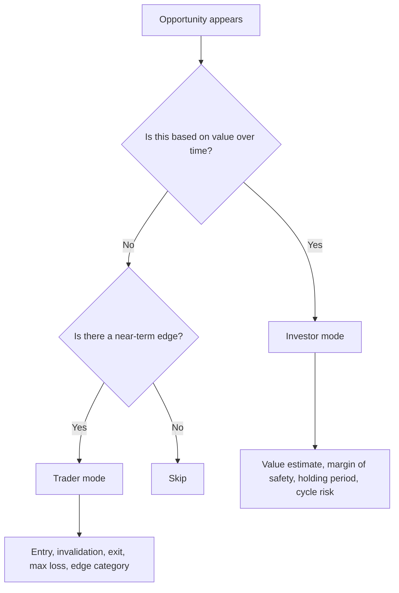
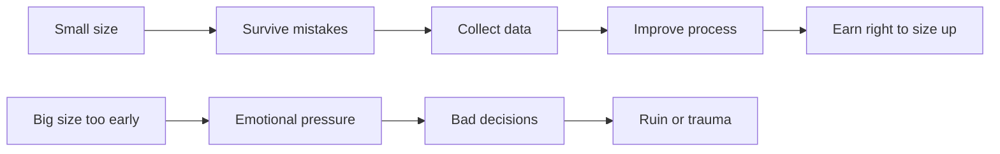
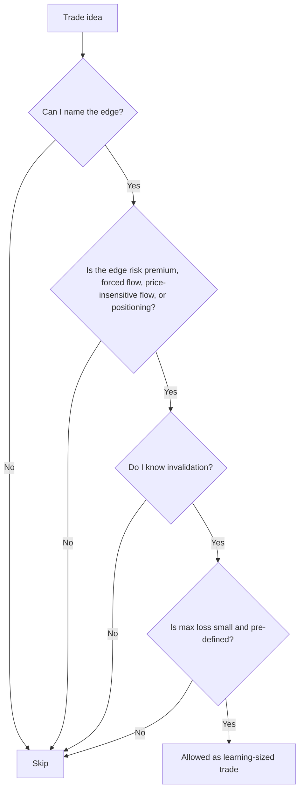

---
title: "Beginner Trader-Investor Learning Path"
type: synthesis
tags: [trading, investing, beginner, risk-management, learning-path, synthesis]
created: 2026-05-10
updated: 2026-05-10
sources: 5
---

# Beginner Trader-Investor Learning Path

This page turns the trading/investing cluster into a beginner roadmap. It draws mainly from [[sources/the-most-important-thing-illuminated]], [[sources/how-to-find-trading-edge]], [[concepts/ergodicity]], [[sources/life-lessons-from-trading]], and [[sources/dealing-with-loss]].

The core rule: **your first goal is not to make money fast. Your first goal is to survive long enough to learn well.**

---

## The Beginner's North Star

Beginner traders usually ask, "What should I buy?" or "What strategy works?"

Better first questions:

- What game am I playing: investing, trading, speculation, or gambling?
- What risk can permanently damage me?
- Why should this opportunity exist for me?
- What would prove me wrong?
- What process will make me better even if this single outcome is noisy?

Markets are adaptive. Edges decay. Luck disguises itself as skill. The beginner's advantage is not prediction; it is humility, small size, good records, and avoiding ruin.

---

## Investor vs Trader: Do Not Blur the Games

| Dimension | Investor | Trader |
|---|---|---|
| Core question | Is price below value enough to justify owning? | Why should price move from here within my timeframe? |
| Main skill | Valuation, patience, cycle awareness | Edge identification, execution, sizing, exits |
| Time horizon | Months to decades | Intraday to months |
| Failure mode | Overpaying, panic-selling, thesis drift | Oversizing, revenge trading, no exit plan |
| Good behavior | Buy value with margin of safety | Take asymmetric bets with clear invalidation |
| Bad behavior | Calling a losing trade an "investment" | Treating a long-term thesis like a quick flip |

The dangerous beginner move is mixing the two: a trade loses money, then becomes a "long-term investment" because the ego refuses to realize the loss. Keep the category clear before entering.

---

## Stage 1: Survival Before Skill

Before learning complex strategies, learn how traders and investors get destroyed.

The survival stack:

1. **[[concepts/position-sizing|Position sizing]]** - define max loss before entry.
2. **No meaningful leverage while learning** - leverage turns ordinary mistakes into existential ones.
3. **Drawdown limit** - if you hit the limit, stop trading and review.
4. **Liquidity awareness** - exits disappear when everyone wants out.
5. **No revenge trading** - do not try to "make it back."
6. **No jackpot sizing** - positive expected value can still ruin you if size is too large.

[[concepts/ergodicity]] is the mathematical foundation here. In repeated-risk games, what matters is not just average expected value but whether one individual path survives over time. A strategy that looks positive in the ensemble can still send most participants to zero.

Practical beginner rule: **build more [[concepts/trading-edge|edge]] before adding size.**

---

## Stage 2: Market Mechanics

Learn the plumbing before the philosophy gets too abstract.

Minimum mechanics:

- bid, ask, spread
- market order vs limit order
- liquidity and slippage
- volatility
- leverage and margin
- fees and taxes
- order books, candles, volume
- settlement and counterparty risk
- basic asset classes: stocks, bonds, commodities, currencies, crypto, derivatives

You do not need to master all markets. You need enough mechanics to understand how a trade can go wrong even when the idea is directionally right.

---

## Stage 3: Price, Value, And Risk

[[entities/howard-marks|Howard Marks]] gives the investor foundation.

Key principles from [[sources/the-most-important-thing-illuminated]]:

- A good asset can be a bad investment at the wrong price.
- A bad-looking asset can be attractive if pessimism makes it too cheap.
- Risk is not just volatility; it is the probability of permanent loss, forced selling, bad timing, leverage, illiquidity, and psychological error.
- Risk is often highest when investors feel safest.
- Cycles and psychology matter because prices are set by people.

Beginner application:

| Question | Why It Matters |
|---|---|
| What is this worth? | Forces value thinking instead of story-following. |
| What expectations are already in the price? | Prevents buying obvious good news too late. |
| What can go permanently wrong? | Moves risk from vague fear to specific analysis. |
| Where are we in the cycle? | Helps avoid maximum enthusiasm and exploit maximum pessimism. |
| What is my margin of safety? | Gives room for being wrong. |

---

## Stage 4: [[concepts/trading-edge|Edge]], Not Vibes

From [[sources/how-to-find-trading-edge]], most assets are priced reasonably most of the time. A retail trader should assume obvious opportunities are already known unless there is a concrete reason otherwise.

Edge usually comes from one of these buckets:

| Edge Bucket | Meaning | Beginner Difficulty |
|---|---|---|
| Risk premia | Get paid for bearing diversified risk patiently | Easier |
| Forced flow | Others must buy/sell for non-economic reasons | Medium |
| Price-insensitive flow | Some participants do not care much about price | Medium |
| Positioning imbalance | Crowding, squeezes, dealer constraints | Hard |
| Information advantage | Knowing something material before others | Very hard and often legally/ethically risky |
| Pure arbitrage | Same thing priced differently | Extremely competitive |

Beginner filter:

If you cannot explain who is on the other side and why they may be wrong, forced, constrained, or overpaying, you probably do not have a trade. You have a feeling.

---

## Stage 5: Second-Order Thinking

[[concepts/second-order-thinking]] is mandatory in markets because the obvious view is usually already reflected in price.

First-order thinking:

> This company is good, so buy.

Second-order thinking:

> Everyone knows this company is good. What expectations are already priced in? What happens if growth is merely good instead of perfect?

Use this checklist:

- What does the market already believe?
- What is consensus?
- What would surprise people?
- What happens after the obvious first consequence?
- What incentives or constraints are shaping behavior?
- What would make the trade work quickly?
- What would make it fail even if the broad idea is right?

---

## Stage 6: The Trading Journal

The journal is not decoration. It is the learning engine.

Every trade/investment gets one entry:

| Field | Prompt |
|---|---|
| Category | Investment, trade, speculation, or experiment? |
| Thesis | Why should this work? |
| Edge | Risk premium, flow, positioning, value gap, or other? |
| Invalidation | What proves the idea wrong? |
| Max loss | How much can I lose? |
| Sizing reason | Why this size? |
| Exit | Profit-taking and stop plan. |
| Emotions | What am I feeling before entry? |
| Review | Good process, bad process, lucky win, or unlucky loss? |

This connects to [[sources/life-lessons-from-trading]]: build identity on process, not on being talented, contrarian, or right. Markets are noisy enough that one outcome cannot validate the whole person.

---

## Stage 7: Loss Protocol

From [[sources/dealing-with-loss]], losses become dangerous when they create revenge, denial, or identity damage.

Loss protocol:

1. Stop trading immediately after a large rule-breaking loss.
2. Do not size up to recover.
3. Re-anchor to current capital, not the old high-water mark.
4. Identify the exact process failure.
5. Turn the failure into a written rule.
6. Resume at reduced size only after review.

The goal is not emotional toughness as a vibe. The goal is structure. A loss should become a better rule.

---

## A Practical 12-Week Beginner Curriculum

| Weeks | Focus | Output |
|---|---|---|
| 1-2 | Market mechanics | Notes on order types, spreads, liquidity, leverage, fees |
| 3-4 | Risk and ergodicity | Personal risk rules and position-sizing template |
| 5-6 | Price/value and Marks framework | One-page checklist for evaluating investments |
| 7-8 | Edge framework | List of possible edges in one chosen market |
| 9-10 | Paper trading or tiny-size trading | 20 journaled trades/investments, no focus on [[concepts/profit|profit]] |
| 11 | Review | Categorize outcomes: process vs luck |
| 12 | System revision | Keep, remove, or refine rules based on evidence |

By the end, the target is not "I am profitable." The target is: **I can describe my game, control my downside, identify my edge category, and review my decisions honestly.**

---

## Beginner Operating Rules

- Never enter without max loss.
- Never use size to compensate for weak conviction.
- Never turn a trade into an investment after it goes against you.
- Never assume a good story means a good price.
- Never confuse a lucky win with skill.
- Never let one position decide your future.
- Prefer boring survival over exciting ruin.
- Keep most capital outside the learning account.
- Increase size only after process quality improves, not after one big win.

---

## What To Learn Next

Investor path:

- valuation basics
- accounting and financial statements
- business quality
- interest rates and discount rates
- cycles and credit conditions
- portfolio construction

Trader path:

- market microstructure
- volatility and liquidity
- [[concepts/position-sizing|position sizing]]
- backtesting and sample size
- execution quality
- flow and positioning
- psychology under pressure

Shared path:

- [[concepts/ergodicity]]
- [[concepts/second-order-thinking]]
- [[concepts/reasonable-expectations]]
- [[concepts/decision-quality-vs-outcome]]
- [[concepts/bubble-detection]]

---

## One-Sentence Summary

A beginner trader-investor should learn to **survive first, separate investing from trading, respect price and risk, demand a named edge, journal every decision, and size small until the process proves itself.**

## Sources

- [[sources/the-most-important-thing-illuminated]]
- [[sources/how-to-find-trading-edge]]
- [[concepts/ergodicity]]
- [[sources/life-lessons-from-trading]]
- [[sources/dealing-with-loss]]
A strong learning path for traders must develop both inductive skill (reading market patterns and participant behavior) and deductive skill (applying risk rules, position sizing, and process discipline). The two reasoning modes serve different but complementary roles.
