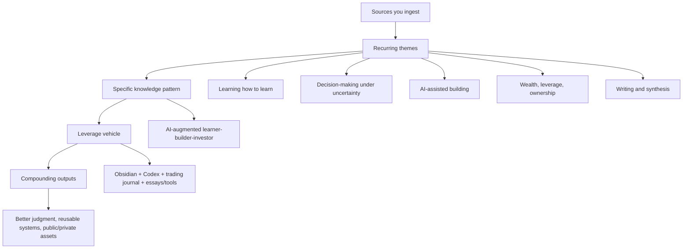
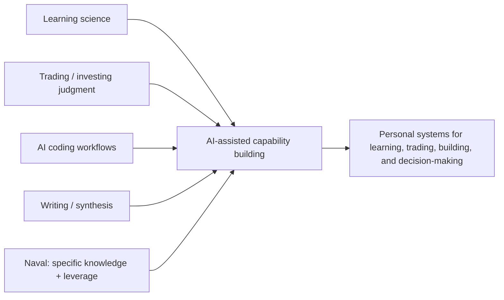
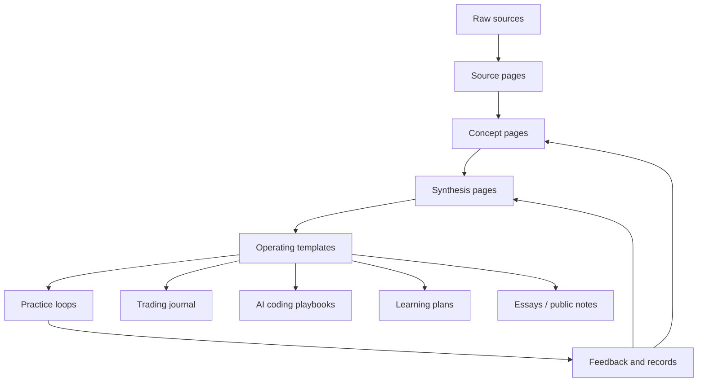

# My Specific Knowledge Map

This page tracks the recurring pattern behind the sources being ingested into the wiki. The surface interests look broad: trading, AI coding, learning science, Naval, Howard Marks, writing, and mental models. Underneath, they point to one coherent direction:

**You are trying to become an AI-augmented learner-builder-investor: someone who learns fast, thinks clearly under uncertainty, builds with leverage, and turns judgment into compounding assets.**

This is not a fixed identity. It is the current pattern suggested by the wiki.

---

## The Core Pattern

The repeated theme is not "trading" by itself, "coding" by itself, or "learning" by itself. The repeated theme is:

> **Build judgment systems in domains where mistakes are costly, then use leverage to compound the useful parts.**

That shows up in five loops:

1. **Learning loop** - become more capable through [[sources/advice-on-upskilling|serious upskilling]], [[concepts/prereq-mastery|prerequisite mastery]], [[concepts/deliberate-practice|deliberate practice]], and [[concepts/learning-is-memory|deep memory]].
2. **Market loop** - survive uncertainty through [[sources/the-complete-collection-howard-marks|Howard Marks]], [[concepts/second-order-thinking|second-order thinking]], [[concepts/trading-edge|edge]], [[concepts/position-sizing|position sizing]], and [[concepts/ergodicity|ruin avoidance]].
3. **AI leverage loop** - use [[sources/ramping-your-coding-output-with-openai-codex|Codex and agentic workflows]] to turn judgment, planning, and review into more output.
4. **Naval loop** - aim effort toward [[concepts/specific-knowledge|specific knowledge]], [[concepts/permissionless-leverage|permissionless leverage]], accountability, ownership, and long-term games.
5. **Writing/synthesis loop** - convert scattered inputs into reusable thinking through essays, articulation, and cross-domain synthesis.

---

## What Themes Keep Appearing?

| Recurring Interest | What It Seems To Mean | What It Gives You | Failure Mode | Best Output |
|---|---|---|---|---|
| [[sources/advice-on-upskilling|Learning / upskilling]] | You want the machinery of self-improvement, not motivational decoration | Faster skill acquisition, better foundations | Endless preparation without enough application | Curricula, practice plans, review systems |
| [[sources/the-complete-collection-howard-marks|Marks / investing]] | You are drawn to judgment under uncertainty | Risk awareness, cycle thinking, price/value discipline | Becoming too abstract or too cautious | Investment/trading checklist, cycle notes, risk journal |
| [[synthesis/beginner-trader-investor-learning-path|Trading]] | You want an applied arena where feedback is real and ego is punished | Edge, sizing, emotional discipline, probabilistic thinking | Overtrading, leverage, mistaking luck for skill | Small-size journaled experiments |
| [[sources/ramping-your-coding-output-with-openai-codex|AI coding]] | You want leverage over execution | Ability to build tools, automate workflows, increase output | Delegating judgment instead of execution | Agents, scripts, dashboards, wiki tools |
| [[sources/the-almanack-of-naval-ravikant|Naval]] | You want a philosophy for wealth, freedom, and personal fit | Direction: specific knowledge + leverage + long-term games | Staying at aphorism level | Personal operating principles |
| [[sources/how-to-articulate-yourself-intelligently|Writing / articulation]] | You want to make your thinking legible and reusable | Communication, public assets, clearer thinking | Consuming more than producing | Essays, memos, synthesis pages |

The strongest repeated signal: **you keep choosing sources about compounding capability.** Not random self-help, not random market tips, not random coding tutorials. The sources cluster around durable capability: learning, judgment, leverage, risk control, synthesis, and self-direction.

---

## Your Specific Knowledge Pattern

[[concepts/specific-knowledge|Specific knowledge]] is knowledge rooted in curiosity, obsession, lived context, and unusual combinations. It is not merely "what subject do I know?" but "what combination of interests makes my judgment hard to copy?"

The wiki suggests your specific knowledge may be forming at this intersection:

In plain English:

**You are not only trying to become a trader, coder, or learner. You are trying to become someone who builds systems for becoming better.**

That is the interesting pattern. The wiki itself is an example: instead of merely reading books and PDFs, you are building a knowledge machine that extracts concepts, links them, audits them, and turns them into operating systems.

---

## What The Wiki Suggests You're Trying To Become

The best current label:

> **A systems-minded operator who uses AI, markets, and learning science to build compounding judgment.**

Possible identity directions:

| Direction | Meaning | Evidence In The Wiki |
|---|---|---|
| AI-augmented researcher | Uses AI agents to process dense material and maintain a second brain | [[concepts/agentic-coding-workflows]], this wiki itself |
| Beginner investor/trader becoming process-driven | Wants to trade/invest without being destroyed by ego, leverage, or vibes | [[synthesis/beginner-trader-investor-learning-path]], [[concepts/trading-edge]], [[concepts/position-sizing]] |
| Leverage-oriented builder | Wants code/media/tools to scale judgment beyond manual effort | [[concepts/permissionless-leverage]], [[sources/ramping-your-coding-output-with-openai-codex]] |
| Skill maximalist | Believes ability can be built through serious training | [[sources/advice-on-upskilling]], [[concepts/deliberate-practice]] |
| Writer/synthesizer | Wants to turn scattered reading into clear frameworks | [[sources/how-to-articulate-yourself-intelligently]], [[sources/something-is-different-about-2026]] |

This is close to Naval's "productize yourself" formula: **yourself** is the unusual taste-pattern across trading, AI coding, learning, and synthesis; **productize** is where Codex, writing, tools, and Obsidian turn that judgment into scalable output.

---

## The Personal Operating Thesis

If this wiki were turned into one thesis, it would be:

> **Learn deeply, think probabilistically, avoid ruin, build with leverage, and convert insight into reusable systems.**

Expanded:

- **Learn deeply** because shallow familiarity creates [[concepts/illusions-of-competence|illusions of competence]].
- **Think probabilistically** because markets, careers, and AI workflows are uncertain.
- **Avoid ruin** because one oversized mistake can end the learning game.
- **Build with leverage** because code, media, and AI agents can scale judgment.
- **Convert insight into systems** because chat insights disappear unless filed, linked, tested, and reused.

---

## Strengths Already Visible

- **You seek foundations.** You ask what prerequisites and beginner rules matter before chasing advanced tactics.
- **You like dense sources.** Marks, Naval, learning science, and AI-coding workflows are not light snacks.
- **You want application.** You repeatedly ask "what should I apply and learn?" rather than only asking for summaries.
- **You care about maintenance.** You ask for linting, concept pages, and Obsidian structure. That means you are not just collecting notes; you are building an operating environment.
- **You combine domains naturally.** Trading, AI coding, learning, and writing look separate, but your questions keep pulling them into one system.

---

## Main Risks

| Risk | What It Looks Like | Countermeasure |
|---|---|---|
| Over-ingestion | Reading everything before practicing anything | Every source should produce one action, checklist, or experiment |
| Domain sprawl | Trading, coding, learning, writing all compete for attention | Treat them as one stack: AI-assisted learning and decision systems |
| Abstract philosophy | Naval/Marks become quotes instead of behavior | Convert each principle into a rule, template, or journal field |
| AI as consumption accelerator | Codex helps ingest more but not build more | Use AI to produce tools, reviews, dashboards, and decisions |
| Trading overconfidence | Good theory creates premature confidence | Keep size tiny until records show process quality |

The most important warning: **do not let the second brain become a beautiful substitute for first-hand reps.** The wiki should push you into practice, then absorb the feedback.

---

## Leverage Map

The wiki becomes valuable when it creates templates you actually use:

- Trading thesis template
- Position-sizing calculator
- Loss protocol
- Codex project brief
- Learning prerequisite map
- Weekly synthesis memo
- "Specific knowledge evidence log"

---

## 30-Day Experiments

### 1. Specific Knowledge Evidence Log

Create a weekly note with four prompts:

- What did I keep returning to without being forced?
- What felt like play to me but looked hard to others?
- What did someone ask me for help with?
- What source or idea changed how I behaved this week?

This tests [[concepts/specific-knowledge|specific knowledge]] against behavior, not self-image.

### 2. Trading Decision Journal

For every trade/investment idea:

- What game is this: investment, trade, speculation, or experiment?
- What is the [[concepts/trading-edge|edge]]?
- What is already priced in?
- What invalidates it?
- What is max loss?
- What is position size and why?
- Was outcome due to process or luck?

This converts Marks into behavior.

### 3. Codex Leverage Sprint

Pick one small workflow and build a tool around it:

- Obsidian link checker
- concept-page generator draft
- trading journal template generator
- flashcards from concept pages
- source-ingest progress tracker

This converts [[concepts/permissionless-leverage|permissionless leverage]] into something visible.

### 4. Weekly Synthesis Page

Each week, write one synthesis page answering:

> What did this week's sources collectively teach me that no single source said alone?

This trains the exact cross-domain muscle your wiki keeps pointing toward.

---

## Questions To Keep Asking

- What do I do even when nobody asks me to?
- Which topic keeps returning after novelty fades?
- Where do I have unusual taste or patience?
- What painful problem am I willing to study longer than most people?
- What can I build that uses my wiki as raw material?
- Which of my interests creates the best feedback loop: trading, coding, writing, or teaching?
- What am I collecting because it is useful, and what am I collecting because it delays action?

---

## Working Hypothesis

Your current specific-knowledge pattern is:

> **AI-assisted synthesis and systems-building for learning and financial decision-making.**

More simply:

> **You are building yourself into a person who can learn hard things, reason under uncertainty, use AI as leverage, and turn knowledge into practical systems.**

This page should be revisited after another 10-20 ingested sources and after you have a few real practice artifacts: trading journal entries, Codex-built tools, essays, or learning plans. The pattern will become sharper once behavior produces feedback.

---

## Sources

- [[sources/the-almanack-of-naval-ravikant]]
- [[concepts/specific-knowledge]]
- [[concepts/permissionless-leverage]]
- [[sources/ramping-your-coding-output-with-openai-codex]]
- [[concepts/agentic-coding-workflows]]
- [[sources/advice-on-upskilling]]
- [[sources/the-complete-collection-howard-marks]]
- [[synthesis/beginner-trader-investor-learning-path]]
- [[sources/something-is-different-about-2026]]
- [[sources/how-to-articulate-yourself-intelligently]]
These operating systems and knowledge maps require both inductive pattern recognition from experience and deductive application of structure and principle.
