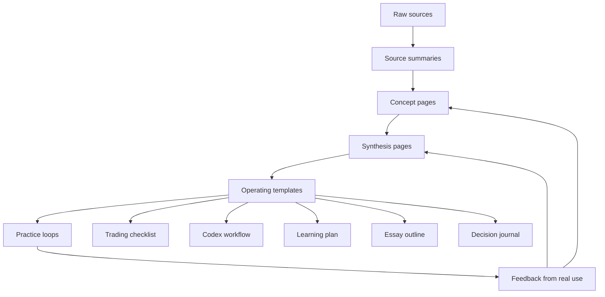
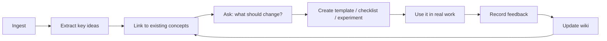

# Second Brain as Leverage System

The Second Brain should not be treated as a nicer archive. An archive stores what happened. A leverage system changes what you are able to do next.

In this wiki, the Second Brain becomes leverage when raw sources are converted into reusable judgment: concept pages, synthesis pages, templates, checklists, prompts, tools, and practice loops. The goal is not to remember everything. The goal is to build an external thinking system that makes better action easier.

---

## Core Claim

> **A Second Brain becomes leverage when it turns reading into reusable decisions, workflows, and assets.**

That means every important source should eventually answer one of these questions:

- What concept should be added or updated?
- What decision rule does this imply?
- What checklist or template should exist?
- What practice loop should this change?
- What tool could automate or amplify this?
- What synthesis connects this to other domains?

If a note never affects a future action, it is storage. If it changes how you learn, trade, code, write, or decide, it is leverage.

---

## Storage Brain vs. Leverage Brain

| Dimension | Storage Brain | Leverage Brain |
|---|---|---|
| Main job | Keep information | Improve future decisions |
| Unit of value | Notes | Reusable judgment |
| Typical output | Summaries | Concepts, templates, checklists, tools, experiments |
| Failure mode | Hoarding | Overbuilding without practice |
| Question asked | "Where did I put this?" | "What does this let me do better?" |
| Maintenance | Organize folders | Link, lint, compress, test, update |

The wiki should still preserve source summaries. But summaries are the raw material. The higher-value layer is synthesis.

---

## The Leverage Stack

The stack compounds because later layers reuse earlier layers:

- A source summary preserves context.
- A concept page compresses repeated ideas.
- A synthesis page finds cross-source patterns.
- A template turns insight into behavior.
- A practice loop produces feedback.
- Feedback updates the wiki.

That final feedback loop is the important part. Without it, the wiki only gets bigger. With it, the wiki gets smarter.

---

## Where Leverage Appears In This Wiki

### 1. Learning Leverage

[[sources/advice-on-upskilling]] and the learning-science cluster argue that skill comes from [[concepts/prereq-mastery|prerequisite mastery]], [[concepts/deliberate-practice|deliberate practice]], retrieval, and high-quality repetition. The wiki should turn that into learning plans, prerequisite maps, and review schedules.

Useful outputs:

- prerequisite map for each new skill
- active recall questions from source pages
- spaced review queue for concepts
- "confusion log" for weak foundations
- weekly skill-practice plan

### 2. Market Judgment Leverage

[[sources/the-complete-collection-howard-marks]] and [[synthesis/beginner-trader-investor-learning-path]] show that markets punish vague thinking. The wiki should turn market reading into decision structure: [[concepts/trading-edge|edge]], [[concepts/position-sizing|position sizing]], cycle awareness, loss protocol, and process review.

Useful outputs:

- trade thesis template
- investment checklist
- loss protocol
- cycle temperature note
- post-trade review rubric

This matters because in trading, knowledge that does not become behavior can still leave you exposed to ruin.

### 3. AI Coding Leverage

[[sources/ramping-your-coding-output-with-openai-codex]] and [[concepts/agentic-coding-workflows]] suggest that AI shifts the human role upward: problem selection, planning, context, review, and quality control. The Second Brain is the context layer that makes agents more useful.

Useful outputs:

- reusable Codex briefs
- task decomposition patterns
- bug-fix postmortems
- project context files
- codebase research notes
- automation ideas from recurring wiki tasks

The wiki becomes an agent memory system: not just what you know, but what future agents can use.

### 4. Specific Knowledge Leverage

[[concepts/specific-knowledge]] and [[synthesis/my-specific-knowledge-map]] imply that your edge may form from unusual combinations: trading judgment, AI workflows, learning science, and synthesis. The Second Brain helps expose those combinations by making recurring themes visible.

Useful outputs:

- recurring-interest tracker
- specific-knowledge evidence log
- "what keeps appearing?" synthesis pages
- map of problems you keep wanting to solve
- public/private essays from repeated insights

Specific knowledge is easier to notice when your past curiosity is visible.

### 5. Communication Leverage

[[sources/how-to-articulate-yourself-intelligently]] frames articulation as a learnable skill. The wiki creates an "inner album" of refined ideas: concepts you have seen enough times that they become reusable in conversation, writing, trading plans, and project briefs.

Useful outputs:

- 8-10 core ideas you can explain anytime
- short explanation snippets for repeated concepts
- essay outlines from synthesis pages
- analogy bank
- decision memos

Writing is not separate from the Second Brain. Writing is how the Second Brain proves it has learned something.

---

## The Operating Loop

Use this as the default workflow after any meaningful source or question:

The critical question is step D:

> **What should change because I read this?**

If nothing changes, the source may still be interesting, but it has not become leverage yet.

---

## Templates This Wiki Should Grow

| Template | Purpose | Source Cluster |
|---|---|---|
| Trading thesis template | Force edge, invalidation, size, and exit clarity | Marks / trading |
| Position-sizing worksheet | Prevent ruin and emotional sizing | Trading / ergodicity |
| Loss protocol | Convert loss into structure | Trading psychology |
| Codex project brief | Give AI agents clean context and boundaries | AI coding |
| Source ingest rubric | Decide what concepts, entities, and syntheses a source should update | LLM wiki |
| Learning plan template | Convert skill goals into prerequisites and reps | Upskilling |
| Specific knowledge log | Track what feels natural, obsessive, and valuable | Naval |
| Weekly synthesis memo | Compress the week into reusable insight | Writing / synthesis |

These are leverage objects. Each one lets future-you act faster and with better judgment.

---

## What To Automate Later

The wiki is also a software product waiting to happen. Possible Codex-built tools:

- broken wiki-link checker
- frontmatter validator
- source ingestion checklist generator
- concept page draft generator
- "stale page" detector
- recurring theme extractor from `wiki/log.md`
- daily or weekly review generator
- flashcards from concept pages
- trading journal page generator
- Dataview dashboard for sources, concepts, and syntheses

This is where [[concepts/permissionless-leverage|permissionless leverage]] becomes concrete: code can turn a private knowledge workflow into a repeatable machine.

---

## Anti-Patterns

| Anti-Pattern | Why It Fails | Fix |
|---|---|---|
| Ingesting without applying | Creates intellectual inventory, not capability | Every source gets one action or template candidate |
| Creating too many tiny concepts | Makes the graph noisy | Merge unless the concept will be reused |
| Synthesis without practice | Feels profound but does not change behavior | Pair synthesis with experiment |
| Automating too early | Tools encode immature process | Run manually until the pattern repeats |
| Letting AI decide importance alone | The system drifts away from your actual goals | Human chooses emphasis; AI handles structure |
| Never linting | Links rot and duplicated concepts multiply | Regular health checks |

The quiet danger is aesthetic productivity: the wiki looks increasingly sophisticated while your behavior stays the same. The leverage test is whether the wiki changes your next rep.

---

## Review Questions

Use these during weekly or monthly review:

- Which notes changed my behavior this week?
- Which concept appeared in multiple domains?
- Which source should become a checklist?
- Which synthesis should become an essay, tool, or template?
- Which pages are interesting but unused?
- What did I practice because the wiki made it obvious?
- What am I avoiding by ingesting more?
- What should Codex automate now that the workflow is repeated enough?

---

## Practical Next Build

The next high-value move is to create a small set of operating pages:

1. **Trading Decision Journal Template**
2. **Codex Project Brief Template**
3. **Specific Knowledge Evidence Log**
4. **Weekly Synthesis Memo Template**
5. **Source Ingest Rubric**

These would turn the wiki from a knowledge graph into an execution surface.

---

## One-Sentence Summary

The Second Brain is leverage when it stops being a place where knowledge goes and becomes a system that makes future learning, trading, coding, writing, and decision-making measurably better.

---

## Sources

- [[synthesis/my-specific-knowledge-map]]
- [[concepts/permissionless-leverage]]
- [[concepts/agentic-coding-workflows]]
- [[sources/ramping-your-coding-output-with-openai-codex]]
- [[sources/the-almanack-of-naval-ravikant]]
- [[sources/advice-on-upskilling]]
- [[synthesis/beginner-trader-investor-learning-path]]
- [[sources/how-to-articulate-yourself-intelligently]]
Leverage systems and knowledge maps combine inductive recognition of high-leverage activities with deductive application of structure and compounding principles.
