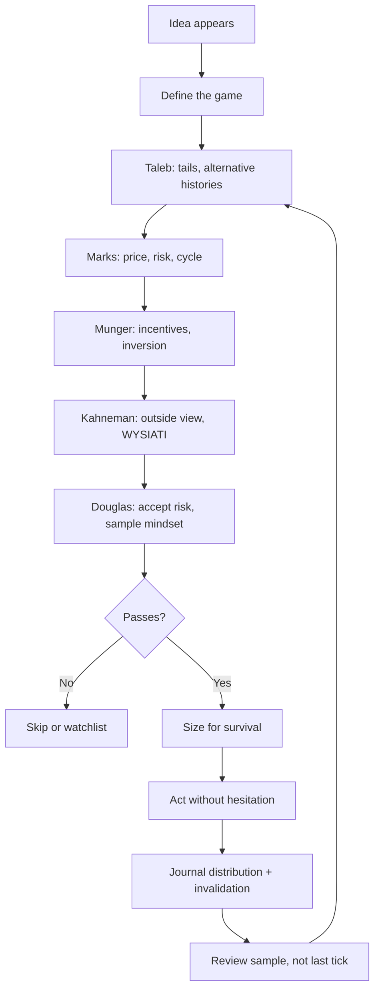

# Uncertainty Market Judgment Operating Model

This page synthesizes [[sources/fooled-by-randomness|Taleb]], [[sources/the-most-important-thing-illuminated|Howard Marks]], [[sources/poor-charlies-almanack|Munger]], [[sources/thinking-fast-and-slow|Kahneman]], and [[sources/trading-in-the-zone|Douglas]] into one operating model for markets and high-stakes decisions.

The shared thesis:

> **Reality is uncertain, outcomes are noisy, humans misjudge both, and survival depends on designing decisions that do not need perfect prediction — then executing them without fear corrupting the process.**

Taleb gives the randomness lens. Marks gives the price/risk/cycle lens. Munger gives psychology and mental models. Kahneman names the mechanisms (heuristics, outcome bias, inside view). Douglas gives the **execution layer**: probabilistic beliefs, accepted risk, and sample-size discipline so analysis actually becomes P&L.

---

## The Five Lenses

| Thinker | Primary Lens | Main Warning | Practical Gift |
|---|---|---|---|
| [[entities/nassim-nicholas-taleb|Taleb]] | Randomness, tails, [[concepts/alternative-histories]] | A lucky path can masquerade as skill | Judge decisions across possible worlds, not only the realized one |
| [[entities/howard-marks|Marks]] | Price, value, risk, cycles | A good asset can be a bad investment at the wrong price | Calibrate exposure by price, risk, and cycle temperature |
| [[entities/charles-munger|Munger]] | Mental models, incentives, psychology | Human misjudgment is systematic and combinatorial | Use checklists, inversion, and multidisciplinary models |
| [[entities/Daniel-Kahneman|Kahneman]] | System 1 vs 2, heuristics, framing | Fast intuition feels true before evidence warrants it | [[concepts/inside-view-outside-view|Outside view]], [[concepts/premortem|premortems]], separate process from outcome |
| [[entities/Mark-Douglas|Douglas]] | Probabilistic execution, accepting risk | Knowing risk ≠ accepting risk; last-trade emotion | [[concepts/probabilistic-trading-mindset|Five truths]], 20-trade samples, [[concepts/seven-principles-of-consistency|seven principles]] |

Overlap at the decision gate:

- Taleb: **the outcome may be luck.**
- Marks: **the price may already reflect the story.**
- Munger: **your mind may be tricking you.**
- Kahneman: **confidence may exceed evidence (WYSIATI).**
- Douglas: **you may understand probability and still fail to act on it.**

If all five pass, the decision may be worth taking — at survivable size.

---

## Core Principle: Survive The Distribution

The first question is not "Can this work?" It is:

> **What happens across the full distribution of possible paths, and can I survive the bad ones?**

Taleb's [[concepts/skewness-and-asymmetry]] and [[concepts/problem-of-induction]] make this non-negotiable. Marks adds that risk is permanent loss, forced selling, bad timing, illiquidity, leverage, and psychological error — not spreadsheet volatility. Munger adds incentive-driven denial. Kahneman adds outcome bias ([[concepts/decision-quality-vs-outcome]]) and [[concepts/planning-fallacy]]. Douglas adds that **living on the last trade** is how traders abandon the distribution mentally even when they understand it intellectually.

Decision filter:

1. What are the plausible [[concepts/alternative-histories]]?
2. What tail can ruin me?
3. What hidden leverage, illiquidity, or correlation makes the tail worse?
4. What psychological tendency would make me ignore the tail?
5. Is the size small enough that I can keep playing?
6. Am I reviewing a **sample**, not a single outcome? (Douglas)

Bridge: [[concepts/ergodicity]] + [[concepts/position-sizing]] — the path matters more than the ensemble average.

---

## The Combined Decision Checklist

### 1. Define The Game

Before analysis, name the game: investment, trade, speculation, or learning experiment. Prevents category drift — a losing trade becoming an "investment," or a learning bet sized like conviction.

### 2. Taleb Check: Randomness And Sample Quality

- Am I confusing luck with skill?
- What would this process look like over 100 alternative histories?
- Who disappeared from the sample? ([[concepts/survivorship-bias]])
- Is the strategy secretly short a rare event?
- Is the payoff positively or negatively skewed?
- Does the evidence depend on "it has worked so far"?

### 3. Marks Check: Price, Risk, And Cycle

- What is it worth? What expectations are priced in?
- Where are we in the cycle or pendulum?
- Am I being paid enough for the risk?
- Cheap for a real reason or a value trap?

### 4. Munger Check: Psychology And Incentives

- What incentives shape the other side — and me?
- Which tendencies are active: social proof, envy, overoptimism, commitment, availability?
- Inversion: how does this fail?
- Inside [[concepts/circle-of-competence]] or labeled experiment?

### 5. Kahneman Check: Mechanism And Calibration

- Am I on [[concepts/system-1-vs-system-2|System 1]] autopilot?
- [[concepts/wysiati|WYSIATI]]: does the story feel complete with partial data?
- [[concepts/inside-view-outside-view|Inside view]] trap: am I ignoring base rates and reference classes?
- [[concepts/planning-fallacy|Planning fallacy]]: is the timeline anchored on best case?
- Will I judge this by outcome afterward? ([[concepts/decision-quality-vs-outcome]])

### 6. Douglas Check: Execution Readiness

- Have I **predefined and accepted** risk, or only placed a stop?
- Can I take this edge without needing to know the next tick?
- Am I taking **every** valid edge or cherry-picking?
- Is size survivable across a 20-trade worst case?
- [[concepts/seven-principles-of-consistency|Seven principles]] intact?

Only after all six: size, act, journal expected distribution + invalidation, review **process vs outcome** over samples.

---

## The Operating Loop



Judgment compounds only when feedback is interpreted correctly — Kahneman's outcome bias and Douglas's last-trade trap are the two most common ways loops get corrupted.

---

## What Each Thinker Corrects In The Others

| Failure Mode | Taleb | Marks | Munger | Kahneman | Douglas |
|---|---|---|---|---|---|
| Recent wins | Random survival | Risk rises with comfort | Self-regard active | Halo + outcome bias | Carefree without beliefs |
| Endless skepticism | Seek convexity | Price compensates | Practical models | Outside view calibrates | Still must act on edge |
| Value trap | Hidden tails | Cycle/quality | Invert cheap thesis | Anchoring on story | Hope on losers |
| Narrative investing | Post-hoc noise | Story priced in | Liking, authority | Substitution heuristic | Association to last trade |
| Overtrading | Tail exposure | Patience = edge | Ego activity | Overconfidence | Boredom, no acceptance |
| Copying winners | Survivorship | Cycle tailwind | Incentive distortion | Availability | Random tips, no plan |

Taleb without Marks → paralysis. Marks without Taleb → hidden distribution risk. Munger without pricing → elegant checklist, wrong level. Kahneman without Douglas → understood bias, unchanged behavior. Douglas without the others → disciplined execution on bad ideas.

---

## Practical Templates

### Trade Or Investment Pre-Mortem

```text
Decision:
Game type:

Taleb:
- Alternative histories:
- Tail that ruins or impairs me:
- Survivorship/sample issue:
- Payoff shape:

Marks:
- Price vs value:
- Risk being compensated:
- Cycle/pendulum position:
- Margin of safety:

Munger:
- Incentives:
- Active psychological tendencies:
- Inversion: how this fails:
- Strongest opposing argument:

Kahneman:
- Reference class / outside view:
- What I might be substituting:
- Pre-outcome record frozen?

Douglas:
- Risk predefined AND accepted:
- Taking every edge or cherry-picking:
- Sample trade # ___ of 20:

Structure:
- Invalidation:
- Max loss:
- Position size:
- Exit/liquidity plan:
```

### Post-Decision Review

Do not ask only "Did I make money?"

Ask:

- Was the thesis clear? Was the edge real or imagined?
- Did the outcome fall inside the expected distribution?
- Was position size appropriate for uncertainty?
- Did I follow invalidation?
- Good process, bad process, lucky win, or unlucky loss?
- Which lens would have caught the error?
- Does the **20-trade sample** still support the edge?

---

## The Personal Rule Set

1. Never let one path prove skill.
2. Never buy a story without asking what is priced in.
3. Never size as if the bad path cannot happen.
4. Never trust a winner-only sample.
5. Never ignore incentives.
6. Never act outside circle of competence without labeling it an experiment.
7. Never review outcomes without separating process from luck.
8. Never seek precision where only calibration exists.
9. Never let activity substitute for patience.
10. Never confuse a stop with accepting risk.
11. Never judge the edge on one trade — judge the sample.
12. Never keep a model you do not practice using ([[concepts/use-it-or-lose-it]]).

---

## Where This Fits In The Wiki

- [[synthesis/beginner-trader-investor-learning-path]] — staged curriculum including Douglas mechanical exercise
- [[concepts/trading-edge]] — why an opportunity should exist
- [[concepts/position-sizing]] — uncertainty → survivable exposure
- [[concepts/probabilistic-trading-mindset]] — execution beliefs
- [[concepts/psychology-of-human-misjudgment]] — Munger + Kahneman overlap
- [[concepts/epistemic-humility]] — Marks "I don't know" school

Keep [[concepts/inductive-reasoning]] and [[concepts/deductive-reasoning]] separate in review: pattern-from-price is inductive; rule-from-principle is deductive — conflating them breeds overconfidence.

## Sources

- [[sources/fooled-by-randomness]]
- [[sources/the-most-important-thing-illuminated]]
- [[sources/the-complete-collection-howard-marks]]
- [[sources/poor-charlies-almanack]]
- [[sources/thinking-fast-and-slow]]
- [[sources/trading-in-the-zone]]
- [[concepts/decision-quality-vs-outcome]]
- [[concepts/position-sizing]]