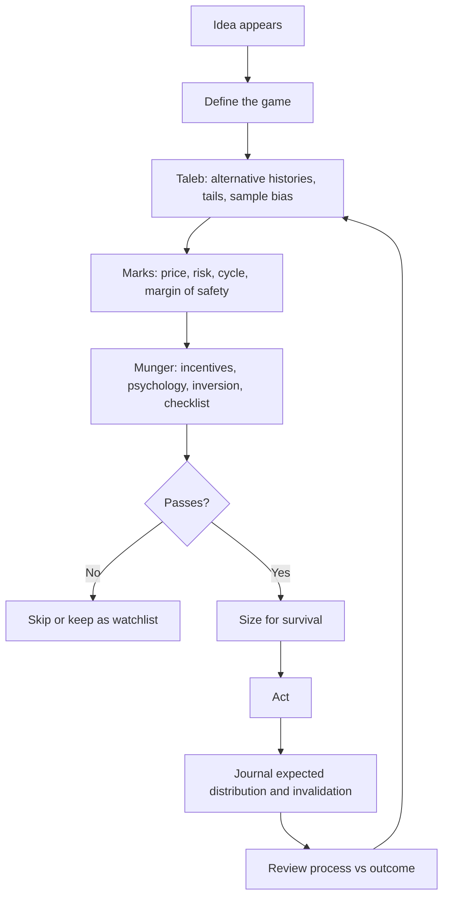

# Uncertainty Market Judgment Operating Model

This page synthesizes [[sources/fooled-by-randomness|Taleb]], [[sources/the-most-important-thing-illuminated|Howard Marks]], and [[sources/poor-charlies-almanack|Munger]] into one operating model for markets and high-stakes decisions.

The shared thesis:

> **Reality is uncertain, outcomes are noisy, humans misjudge both, and survival depends on designing decisions that do not need perfect prediction.**

Taleb gives the randomness lens. Marks gives the price/risk/cycle lens. Munger gives the psychology and mental-models lens. Together they form a practical discipline: think in distributions, demand price/value discipline, inspect incentives and biases, size for bad paths, and review process instead of worshiping outcomes.

---

## The Three Lenses

| Thinker | Primary Lens | Main Warning | Practical Gift |
|---|---|---|---|
| [[entities/nassim-nicholas-taleb|Taleb]] | Randomness, tails, [[concepts/alternative-histories]] | A lucky path can masquerade as skill | Judge decisions across possible worlds, not only the realized one |
| [[entities/howard-marks|Marks]] | Price, value, risk, cycles | A good asset can be a bad investment at the wrong price | Calibrate exposure by price, risk, and cycle temperature |
| [[entities/charles-munger|Munger]] | Mental models, incentives, psychology | Human misjudgment is systematic and combinatorial | Use checklists, inversion, and multidisciplinary models |

Their overlap is where the real operating model lives:

- Taleb says: **the outcome may be luck.**
- Marks says: **the price may already reflect the story.**
- Munger says: **your mind may be tricking you.**

If all three pass, the decision may be worth taking.

---

## Core Principle: Survive The Distribution

The first question is not "Can this work?" It is:

> **What happens across the full distribution of possible paths, and can I survive the bad ones?**

Taleb's [[concepts/skewness-and-asymmetry]] and [[concepts/problem-of-induction]] make this non-negotiable. Marks' risk framework adds that risk is not volatility in a spreadsheet; it is permanent loss, forced selling, bad timing, illiquidity, leverage, and psychological error. Munger adds that incentives, ego, envy, social proof, and denial can make the worst path more likely exactly when confidence feels highest.

Decision filter:

1. What are the plausible [[concepts/alternative-histories]]?
2. What tail can ruin me?
3. What hidden leverage, illiquidity, or correlation makes the tail worse?
4. What psychological tendency would make me ignore the tail?
5. Is the size small enough that I can keep playing?

This is the bridge between [[concepts/ergodicity]] and [[concepts/position-sizing]]. In repeated-risk games, the path matters more than the average.

---

## The Combined Decision Checklist

### 1. Define The Game

Before analysis, name the game:

- Investment
- Trade
- Speculation
- Learning experiment
- Career/project bet

This prevents category drift. A trade that goes wrong should not quietly become an "investment." A learning experiment should not be sized like a conviction bet.

### 2. Taleb Check: Randomness And Sample Quality

Ask:

- Am I confusing luck with skill?
- What would this process look like over 100 alternative histories?
- Who disappeared from the sample? See [[concepts/survivorship-bias]].
- Is the strategy secretly short a rare event?
- Is the payoff positively or negatively skewed?
- Does the evidence depend on "it has worked so far"?

Taleb's default posture is suspicion toward clean stories built from noisy outcomes.

### 3. Marks Check: Price, Risk, And Cycle

Ask:

- What is the asset/business/trade actually worth?
- What expectations are already in the price?
- Where are we in the cycle or pendulum?
- What is the market already enthusiastic or despondent about?
- What would make this cheap for a real reason rather than a fake bargain?
- Am I being paid enough for the risk?

Marks prevents Taleb-style skepticism from becoming paralysis. You do not need certainty; you need price, odds, and margin for error.

### 4. Munger Check: Psychology And Incentives

Ask:

- What incentives shape the other side?
- What incentives shape me?
- Which Munger tendencies are active: social proof, envy, overoptimism, authority, deprival-superreaction, commitment, availability?
- What would inversion say: how would this fail?
- Am I inside my [[concepts/circle-of-competence]]?
- Can I state the strongest argument against my view?

Munger's contribution is that the opponent is not only the market. It is also your own cognition under pressure.

### 5. Size And Structure

Only after the first four checks:

- What is the maximum acceptable loss?
- What invalidates the thesis?
- What liquidity do I need to exit?
- What correlation am I ignoring?
- What happens if I am right but early?
- What happens if I am wrong but lucky at first?

Size is the proof that you actually believe in uncertainty. If the size assumes the best path, the analysis is decorative.

---

## The Operating Loop



The loop matters because none of the three thinkers believes judgment is a one-shot act. Judgment compounds through feedback, but only if the feedback is interpreted correctly.

---

## What Each Thinker Corrects In The Others

| Failure Mode | Taleb Correction | Marks Correction | Munger Correction |
|---|---|---|---|
| Overconfidence from recent wins | Could be random survival | Risk may be rising as comfort rises | Self-regard and social proof are active |
| Endless skepticism | Look for convexity, not certainty | Price can compensate for uncertainty | Use practical models, not clever paralysis |
| Value trap | Bad paths may be hidden | Cheap can get cheaper if cycle/quality are poor | Invert: why does this deserve to be cheap? |
| Narrative investing | Story may be post-hoc noise | Story may already be priced in | Liking, authority, and availability can distort judgment |
| Overtrading | More trials can expose tail risk | Patience is part of edge | Activity often satisfies ego, not reason |
| Copying winners | Survivorship bias | Past returns may reflect cycle tailwind | Incentives and sample selection matter |

This is why the synthesis is stronger than any single thinker. Taleb without Marks can become pure tail-risk suspicion. Marks without Taleb can understate hidden distribution problems. Munger without both can become a beautiful checklist without market-specific pricing discipline.

---

## Practical Templates

### Trade Or Investment Pre-Mortem

```text
Decision:
Game type:

Taleb:
- Alternative histories:
- Tail that ruins or impairs me:
- Survivorship/sample issue:
- Payoff shape:

Marks:
- Price vs value:
- Risk being compensated:
- Cycle/pendulum position:
- Margin of safety:

Munger:
- Incentives:
- Active psychological tendencies:
- Inversion: how this fails:
- Strongest opposing argument:

Structure:
- Invalidation:
- Max loss:
- Position size:
- Exit/liquidity plan:
```

### Post-Decision Review

Do not ask only "Did I make money?"

Ask:

- Was the thesis clear?
- Was the edge real or imagined?
- Did the outcome fall inside the expected distribution?
- Was the position too large for the uncertainty?
- Did I follow invalidation?
- Was this good process, bad process, lucky win, or unlucky loss?
- Which model should be updated?

This ties directly to [[concepts/decision-quality-vs-outcome]].

---

## The Personal Rule Set

1. **Never let one path prove skill.** A result is evidence, not a verdict.
2. **Never buy a story without asking what is priced in.**
3. **Never size a position as if the bad path cannot happen.**
4. **Never trust a winner-only sample.**
5. **Never ignore incentives.**
6. **Never act outside your circle of competence without labeling it a learning experiment.**
7. **Never review outcomes without separating process from luck.**
8. **Never seek precision where the system only allows calibration.**
9. **Never let activity substitute for patience.**
10. **Never keep a model you do not practice using.**

The final rule comes from Munger's [[concepts/use-it-or-lose-it]] tendency: the operating model is only useful if it becomes a repeated checklist, not a page you admire once.

---

## Where This Fits In The Wiki

This synthesis sits at the center of the user's market-judgment cluster:

- [[synthesis/beginner-trader-investor-learning-path]] gives the beginner curriculum.
- [[concepts/trading-edge]] asks why an opportunity should exist.
- [[concepts/position-sizing]] turns uncertainty into survivable exposure.
- [[concepts/ergodicity]] explains why survival over time matters.
- [[concepts/psychology-of-human-misjudgment]] explains why the mind misreads the game.
- [[concepts/epistemic-humility]] keeps confidence calibrated.

The next useful artifact would be a reusable decision-journal template based on this page.

## Sources

- [[sources/fooled-by-randomness]]
- [[sources/the-most-important-thing-illuminated]]
- [[sources/the-complete-collection-howard-marks]]
- [[sources/poor-charlies-almanack]]
- [[concepts/decision-quality-vs-outcome]]
- [[concepts/position-sizing]]

Market judgment under uncertainty requires clear separation between inductive pattern recognition from price and volume data and deductive application of established principles and rules. Confusing the two is a common source of overconfidence.
